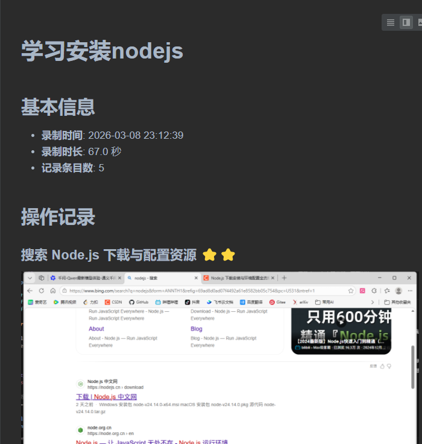
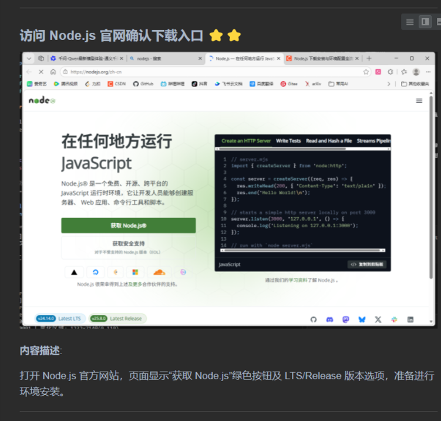
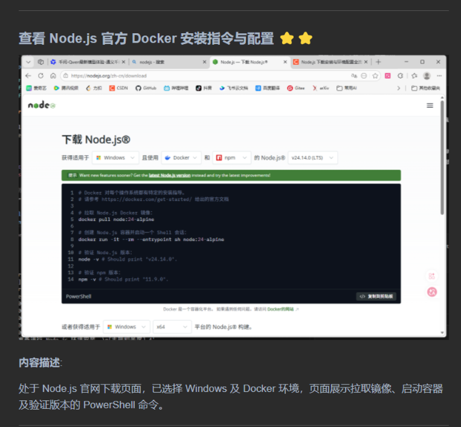

# 🌊 AutoFlowNote
### **Your Screen, Your Story, Automatically Told.**

> **无感捕捉 · 智能理解 · 自动成稿**  
> 告别手动截图和繁琐整理。AutoFlowNote 像水流一样伴随你的操作，利用多模态 AI 自动将屏幕活动转化为结构清晰、重点突出的智能笔记与审计报告。

[](LICENSE)
[](https://www.python.org/)
[](https://qwenlm.github.io/)

---

## 💡 为什么需要 AutoFlowNote？

在数字化工作流中，我们常常面临这样的困境：
- 🛑 **打断心流**：为了记录步骤，不得不频繁暂停、截图、重命名。
- 🌫️ **信息过载**：录屏视频太长，关键信息淹没在几十分钟的等待和加载中。
- 📝 **整理痛苦**：面对几百张截图，手动编写文档是一场噩梦。

**AutoFlowNote** 是您的**影子抄写员**。它在后台静默运行，自动捕捉关键帧，利用强大的 **Qwen3.5-flash** 多模态大模型理解屏幕内容，自动过滤噪音，并生成一份**带评分、带摘要、层级分明**的 Markdown 报告。

---

## ✨ 核心亮点

- 🧠 **AI 深度理解**：不只是保存图片，AI 会分析每一帧，自动生成**标题**、**详细描述**和**相关性评分 (1-5)**。
- 🌊 **无感流式体验**：Zero-interaction design。无需点击，无需配置，安装即运行，完全不打断您的工作心流。
- 📊 **智能分级渲染**：
    - **高分 (4-5 星)**：关键操作步骤，**直接展开**，高亮显示。
    - **中分 (2-3 星)**：过渡状态，**自动折叠**，保持页面整洁。
    - **低分 (1 星)**：加载/黑屏/重复画面，**深度归档**，仅作为时间线参考。
- 📄 **一键导出**：生成标准 Markdown 文件，完美兼容 **Obsidian**, **Typora**, **Notion**, **GitHub**。
- 🎯 **智能焦点追踪**：自动识别并裁剪当前活动窗口，彻底忽略背景杂乱信息。独创动态变化感知算法，在浏览长网页时，自动锁定滚动内容区域，剔除静止的侧边栏和导航条，让 AI 专注于真正变化的信息。

---

## 📸 效果展示
### 生成的 Markdown 报告






---

## 🚀 快速开始

### 1. 环境要求

- Python 3.8+
- Windows 10/11（需要支持屏幕截图）
- 阿里云百炼 API Key（或本地 Ollama 服务）

### 2. 安装步骤

#### 2.1 克隆项目

```bash
git clone https://github.com/your-repo/auto-flow-note.git
cd auto-flow-note
```

#### 2.2 创建虚拟环境（推荐）

```bash
# 创建虚拟环境
python -m venv venv

# 激活虚拟环境
# Windows:
venv\Scripts\activate
# Linux/Mac:
source venv/bin/activate
```

#### 2.3 安装依赖

```bash
pip install -r requirements.txt
```

#### 2.4 配置 API

复制配置示例文件并修改：

```bash
copy config.yaml.example config.yaml
```

编辑 `config.yaml`，填入你的阿里云 API Key：

```yaml
# 阿里云配置
aliyun:
  api_key: "sk-你的API-Key"
  default_model: "qwen3.5-flash"
```

**注意**：也可以使用本地 Ollama 模型，修改配置：

```yaml
# Ollama 本地模型配置
ollama:
  base_url: "http://localhost:11434"
  model: "qwen3-vl:2b"

# 分析器类型: "qwen" (阿里云) 或 "ollama" (本地)
analyzer:
  type: "ollama"
```

### 3. 运行程序

```bash
python main.py
```

程序会：
1. 倒计时 3 秒（给你时间切换到目标窗口）
2. 开始自动录制屏幕
3. 检测画面变化并保存关键帧
4. 使用 AI 分析每帧内容
5. 生成带图片的 Markdown 报告

### 4. 查看结果

运行结束后，在 `outputs/session_YYYYMMDD_HHMMSS/` 目录下查看：

```
session_20260308_221647/
├── raw/           # 原始截图
├── annotated/     # 标注图片（含变化区域框选）
├── debug/         # 调试图片（变化检测中间结果）
├── md_images/    # Markdown 报告使用的图片
├── logs/         # 运行日志和 AI 分析记录
├── README.md     # 生成的图文报告
└── topic.txt     # 录制主题
```

---

## ⚙️ 配置说明

| 配置项 | 说明 | 默认值 |
|--------|------|--------|
| `capture.interval` | 截屏间隔(秒) | 0.5 |
| `capture.duration` | 录制总时长(秒) | 60 |
| `detector.similarity_threshold` | 哈希相似度阈值 (0-20，越小越严格) | 6 |
| `detector.min_change_area` | 最小变化面积(像素) | 500 |
| `analyzer.type` | 分析器类型：`qwen` 或 `ollama` | qwen |
| `analyzer.min_relevance` | 最小相关度阈值 (1-5) | 3 |

---

## 📁 项目结构

```
auto-flow-note/
├── main.py                 # 主程序入口
├── config.yaml             # 配置文件
├── requirements.txt         # Python 依赖
├── src/
│   ├── analyzer/           # AI 分析模块
│   │   ├── base.py         # 分析器抽象基类
│   │   ├── vision_recorder.py  # 阿里云 Qwen 分析器
│   │   └── ollama_vision.py    # Ollama 本地分析器
│   ├── capture/            # 屏幕捕获模块
│   │   ├── screen_capturer.py  # 屏幕截图
│   │   └── change_detector.py  # 变化检测
│   └── utils/              # 工具模块
│       ├── config_loader.py    # 配置加载
│       └── logger.py           # 日志工具
├── tools/                  # 辅助工具脚本
└── outputs/                # 输出目录（自动生成）
```

---

## 🛠️ 高级用法

### 使用命令行参数

```bash
python main.py --config custom_config.yaml --duration 30 --debug
```

参数说明：
- `--config`: 指定配置文件路径
- `--duration`: 覆盖配置文件中的录制时长
- `--debug`: 开启调试模式，保存中间过程图片

### 切换 AI 模型

在 `config.yaml` 中修改：

```yaml
# 阿里云模型
analyzer:
  type: "qwen"
  # 可选：qwen3.5-flash, qwen3.5-flash-2026-02-23, qwen-vl-plus 等

# 或本地 Ollama 模型
analyzer:
  type: "ollama"
  # 需要先下载模型：ollama pull qwen3-vl:2b
```

---

## 🔮 后续计划

AutoFlowNote 正在持续进化中，以下是我们即将实现的功能，同时欢迎大家提issue，一起打造一个智能、无感、无干扰的AI工作流工具：

### 1️⃣ 前端对话窗口与配置页面
- 🎨 **可视化操作界面**：告别命令行和 YAML 配置，提供直观的 GUI 配置面板
- 💬 **实时对话交互**：在前端窗口中与 AI 实时对话，调整分析参数、查看进度
- 📊 **状态监控仪表板**：实时显示录制状态、AI 分析进度、资源占用情况

### 2️⃣ 智能文档分析与 RAG 问答
- 📚 **深度文档理解**：基于生成的笔记文档，构建检索增强生成（RAG）系统
- ❓ **交互式问答**：针对已记录的工作流程，以问答形式获取详细信息
  - *"我在哪个步骤配置了 API Key？"*
  - *"第三步使用的什么命令？"*
  - *"整个流程花了多长时间？"*
- 🔍 **语义检索**：无需手动翻阅文档，AI 自动定位相关内容并生成精准回答
- 📖 **上下文关联**：结合前后步骤的上下文，提供更完整的解答

### 3️⃣ 智能子文档提取与精炼总结
- 🎯 **关键信息萃取**：从大量截图中自动识别最具代表性的关键帧
- 📝 **自动生成摘要**：为每个操作步骤生成一句话精炼总结
- 📑 **分层文档结构**：
  - **高层概览**：仅展示核心步骤（5 星关键帧），快速了解整体流程
  - **详细版本**：包含所有重要细节，适合回顾学习
  - **完整归档**：保留全部时间线，用于审计追溯
- 🔄 **多粒度输出**：根据需求自动生成不同详细程度的文档版本
  - *快速汇报版*：只保留最关键的操作节点
  - *标准教程版*：包含必要的步骤说明和注意事项
  - *完整审计版*：详尽记录所有操作细节和时间戳

---

## 📝 许可

Apache License 2.0 - see [LICENSE](LICENSE) for details.

---

## 🙏 致谢

- [Qwen](https://qwenlm.github.io/) - 阿里云千问多模态大模型
- [Ollama](https://ollama.ai/) - 本地大模型运行框架
- [OpenCV](https://opencv.org/) - 计算机视觉库
