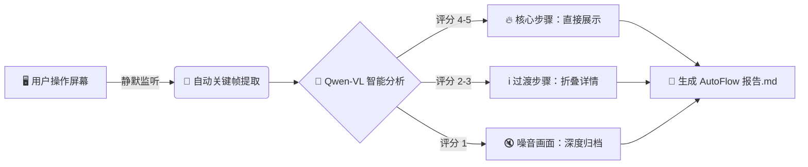

# 🌊 AutoFlowNote
### **Your Screen, Your Story, Automatically Told.**

> **无感捕捉 · 智能理解 · 自动成稿**  
> 告别手动截图和繁琐整理。AutoFlowNote 像水流一样伴随你的操作，利用多模态 AI 自动将屏幕活动转化为结构清晰、重点突出的智能笔记与审计报告。

---

## 💡 为什么需要 AutoFlowNote？

在数字化工作流中，我们常常面临这样的困境：
- 🛑 **打断心流**：为了记录步骤，不得不频繁暂停、截图、重命名。
- 🌫️ **信息过载**：录屏视频太长，关键信息淹没在几十分钟的等待和加载中。
- 📝 **整理痛苦**：面对几百张截图，手动编写文档是一场噩梦。

**AutoFlowNote** 是您的**影子抄写员**。它在后台静默运行，自动捕捉关键帧，利用强大的 **Qwen3.5-flash** 多模态大模型理解屏幕内容，自动过滤噪音，并生成一份**带评分、带摘要、层级分明**的 Markdown 报告。

---

## ✨ 核心亮点

- 🧠 **AI 深度理解**：不只是保存图片，AI 会分析每一帧，自动生成**标题**、**详细描述**和**相关性评分 (1-5)**。
- 🌊 **无感流式体验**：Zero-interaction design。无需点击，无需配置，安装即运行，完全不打断您的工作心流。
- 📊 **智能分级渲染**：
    - **高分 (4-5 星)**：关键操作步骤，**直接展开**，高亮显示。
    - **中分 (2-3 星)**：过渡状态，**自动折叠**，保持页面整洁。
    - **低分 (1 星)**：加载/黑屏/重复画面，**深度归档**，仅作为时间线参考。
- 📄 **一键导出**：生成标准 Markdown 文件，完美兼容 **Obsidian**, **Typora**, **Notion**, **GitHub**。

---

## 🎬 工作原理

